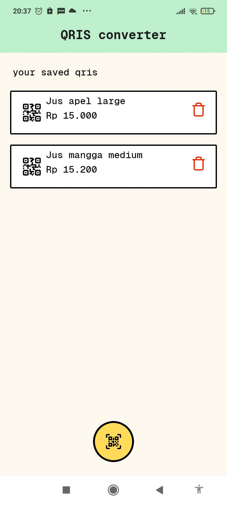

# QRIS Static to Dynamic

Aplikasi mobile ini yang dibuat dengan react native digunakan untuk merubah QRIS Statis ke Dinamis tujuannya adalah mempermudah dalam pembayaran dengan nilai tetap sehingga usert tidak perlu input harga pada e-walletnya.


## 🚀 Fitur

- Konversi dan parsing data QRIS
- Tampilan ringan dan responsif
- Dibuat menggunakan React Native + Expo

---

## 🛠️ Requirements

- Node.js >= 16.x
- npm atau yarn
- [Expo CLI](https://docs.expo.dev/get-started/installation/)

---

## 🧑‍💻 Cara Menjalankan

1. **Clone repository:**

```bash
git clone https://github.com/zarlicho/QRIS-CONVERTERAPP.git
cd QRIS-CONVERTERAPP
```
## 📸 Preview Aplikasi




